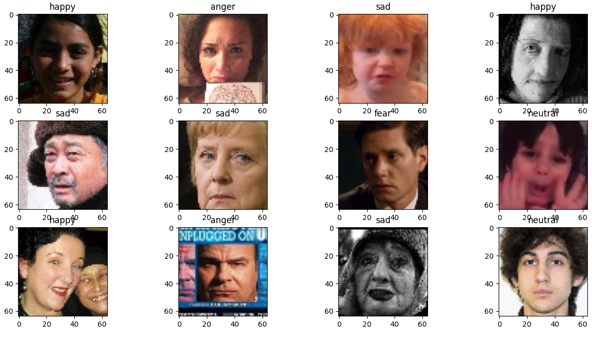

# Machine Learning Project (Group 25)

## Abstract

## How to run the experiments
- Download the dataset folder from [link](https://github.com) to the working directory (i.e contaning this README file)
- Make sure you have Python 3.8.5 installed
- `python -m pip install --upgrade pip`
- `pip install -r requirements.txt`

## Files Description
- **Best Classifier Comparison**: 
	Compares KNN, SVM and Decision Tree classifiers on a validation on the emotion recognition task 
source file: `best classifier model.py`

- **Best Feature Reduction Layer**: 
Experiment to observe the best fully connected layer of the CNN for feature reduction. This is done using a SVM to observe the layer that best reduces the feature vectors 
source file: `best_layer_for_reduction.py`

- **Further Feature Reduction:**: 
Experiment to observe a suitable feature reduction (using PCA) on the CNN features. 
source file: `best_PCA.py`

- **Music Recommendation**: 
Recommends songs based on the probabilistic classification of the mood of a given input image 
source file: `music_recommendation.py`

## Results
**Emotion Classification Performance**\

**Emotion Recognition**\
\
**Music Recommendation**\
\
\
\

## Authors
- [Brown Ogum](https://github.com/brown532)
- [Daniel Salamon](https://github.com/DanielSalamon)
- [Jelle Bosch](https://github.com/JRABosch)

