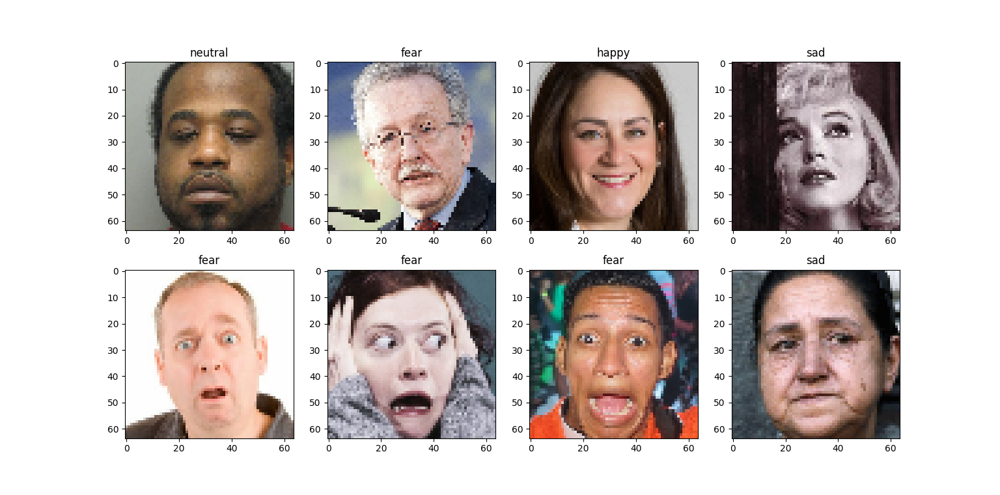
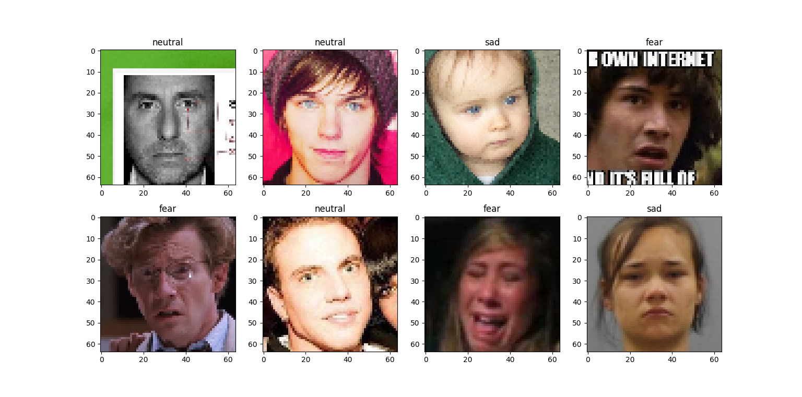

# Music Recommendation Based on Facial Expressions Recognition Using Transfer Learning
Approach

## Abstract
To help people who cannot choose from the amazing online collections of music we can access today, streaming services have created music recommender systems based on listening history. It has however been argued that music is most satisfying when it is based on the listener’s context rather than their history. In this paper, the construction and validation of a music recommender system that approaches the listener’s context by recognizing their emotional state from their facial expression, are described. The system firstly aims to provide more satisfying recommendation by using a context-based approach and secondly aims to promote positive emotions by mediating negativity with music. 24.000 facial expression images that depict happy, sad, neutral, angry and fearful faces were classified through feature extraction with a VGG16 neural network and subsequent emotion prediction with three different classification models, which were compared on their performance. Finally, music feature vectors appropriate for the predicted emotions were matched to a large music database to recommend a song. The combination of a VGG16 feature extractor, PCA dimension reduction and a SVM classifier resulted in the best performance for the Facial Expression Recognition task. Overall, the proposed song-matching model was able to provide satisfying recommendations.

## How to run the experiments
- Download the dataset folder from [link](https://drive.google.com/drive/folders/1PcH4zz2A-5jkOaWF5wiK3Nn7C5Gm9Quh?usp=sharing) to the working directory (i.e contaning this README file)
- Make sure you have Python 3.8.5 installed
- `python -m pip install --upgrade pip`
- `pip install -r requirements.txt`

## Files Description
- **Best Classifier Comparison**: 
	Compares KNN, SVM and Decision Tree classifiers on a validation on the emotion recognition task 
source file: `best classifier model.py`

- **Best Feature Reduction Layer**: 
Experiment to observe the best fully connected layer of the CNN for feature reduction. This is done using a SVM to observe the layer that best reduces the feature vectors 
source file: `best_layer_for_reduction.py`

- **Further Feature Reduction:**: 
Experiment to observe a suitable feature reduction (using PCA) on the CNN features. 
source file: `best_PCA.py`

- **Music Recommendation**: 
Recommends songs based on the probabilistic classification of the mood of a given input image 
source file: `music_recommendation.py`

- **FER_model directory** 
	- `model.py`: contains a script that builds adapted VGG16 architecture for Facial Expressions Recognition task.
	- `train.py`: performs training of the neural network and plots the training history.

## Results
## Emotion Classification Performance
 
## Emotion Recognition
 
 
 
## Music Recommendation

## Authors
- [Brown Ogum](https://github.com/brown532)
- [Daniel Salamon](https://github.com/DanielSalamon)
- [Jelle Bosch](https://github.com/JRABosch)

## Reference
For this project, AffectNet Database was partially used. We refer to the author's paper for more details:
 - A. Mollahosseini; B. Hasani; M. H. Mahoor, "AffectNet: A Database for Facial Expression, Valence, and Arousal Computing in the Wild," in IEEE Transactions on Affective Computing, 2017.
